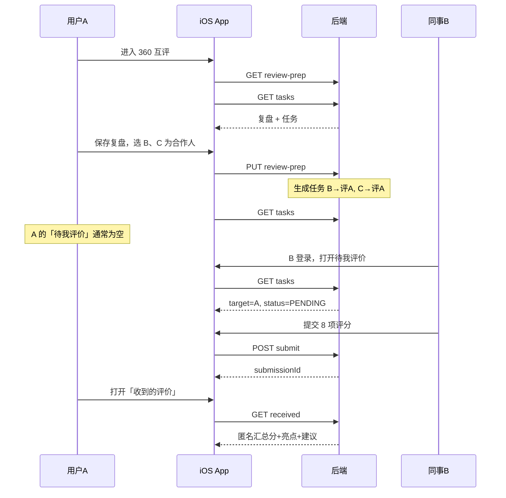

# OKR 360 互评 — iOS 接口文档

> 与 Android `hiddendanger` 模块对齐，供 iOS 联调使用。  
> 文档版本：2026-07-08

---

## 1. 环境与通用约定

### 1.1 Base URL

与 OKR / 工单同源：

```text
http://47.110.156.186:9220/
```

完整路径示例：

```text
GET http://47.110.156.186:9220/mobile/okr/peer-eval/tasks?period=quarter-2
```

### 1.2 请求头（必填）

| Header | 类型 | 说明 |
|--------|------|------|
| `X-User-Id` | Long 字符串 | 当前登录用户 ID，**所有互评接口必带** |
| `Content-Type` | String | POST / PUT 使用 `application/json` |

示例：

```http
X-User-Id: 10001
Content-Type: application/json
```

### 1.3 响应包装 `BaseResp<T>`

```json
{
  "code": 200,
  "msg": "操作成功",
  "data": { }
}
```

| 字段 | 类型 | 说明 |
|------|------|------|
| code | Int | `200` 表示成功；`500` 等为业务失败 |
| msg | String | 提示文案，**失败时必须展示给用户** |
| data | T | 业务数据，可能为 `null` |

> Android 兼容字段别名：`code` ↔ `errorCode`，`msg` ↔ `errorMsg` / `message`。

### 1.4 互评周期 `period`

| 值 | 含义 |
|----|------|
| `quarter-1` ~ `quarter-4` | 季度 |
| `year` | 年度（互评一般不用） |

**互评固定使用「上一已结束季度」**，不要传「我的目标」当前 Tab 的 quarter。

| 当前月份 | 互评 period |
|----------|-------------|
| 1–3 月 | `quarter-4`（上一季度 Q4） |
| 4–6 月 | `quarter-1` |
| 7–9 月 | `quarter-2` |
| 10–12 月 | `quarter-3` |

iOS 参考实现（与 Android `OkrPeriodHelper.peerEvalPeriod()` 一致）：

```swift
func peerEvalPeriod(from date: Date = Date()) -> String {
    let month = Calendar.current.component(.month, from: date)
    switch month {
    case 1...3: return "quarter-4"
    case 4...6: return "quarter-1"
    case 7...9: return "quarter-2"
    default:    return "quarter-3"
    }
}
```

### 1.5 核心业务规则（必读）

| 规则 | 说明 |
|------|------|
| 选合作同事 | 表示「邀请 TA 来评我」，**不是**「我去评 TA」 |
| 待我评价列表 | `evaluator = 当前用户`，`target = 被评人` |
| 收到的评价 | 聚合所有 `target = 当前用户` 的 submission，**匿名** |
| 保存复盘后 | 为每个合作人生成任务：合作人 → 评我 |
| 重复提交 | 同一周期对同一 `targetUserId` 不可重复 submit |

---

## 2. 接口清单

| # | 方法 | 路径 | 说明 | 优先级 |
|---|------|------|------|--------|
| 1 | GET | `/mobile/okr/peer-eval/review-prep` | 获取复盘 | P0 |
| 2 | PUT | `/mobile/okr/peer-eval/review-prep` | 保存复盘 | P0 |
| 3 | GET | `/mobile/okr/peer-eval/tasks` | 待我评价任务列表 | P0 |
| 4 | POST | `/mobile/okr/peer-eval/submit` | 提交互评 | P0 |
| 5 | GET | `/mobile/okr/peer-eval/submission` | 我发出的评价详情 | P1 |
| 6 | GET | `/mobile/okr/peer-eval/received` | 我收到的评价（匿名汇总） | P1 |
| 7 | GET | `/mobile/okr/peer-eval/colleagues` | 可选同事列表（选人） | P0 |
| 8 | GET | `/mobile/okr/peer-eval/summary` | 互评摘要（可选） | 可选 |
| 9 | POST | `/mobile/okr/peer-eval/add-collaborator` | 增量添加合作人（可选） | 可选 |
| — | GET | `/mobile/okr/align-options` | colleagues 失败时的兜底 | 兜底 |

> **Android 当前实现**：首页卡片与互评页 **不调用 `summary`**，改用 `tasks`（待评/已评人数）+ `received`（收到评价，懒加载）。iOS 可同样实现以减少请求；`summary` 仍可作为一次性拉取摘要的便捷接口。

---

## 3. 推荐调用顺序

### 3.1 首次进入 360 互评页

```text
1. GET  /peer-eval/review-prep?period={peerEvalPeriod}
2. GET  /peer-eval/tasks?period={peerEvalPeriod}
```

「收到的评价」Tab **切换时再调**：

```text
3. GET  /peer-eval/received?period={peerEvalPeriod}   // 懒加载
```

### 3.2 打开选人弹窗

```text
GET /peer-eval/colleagues
// 失败时 fallback: GET /mobile/okr/align-options → 取 users 列表，排除自己
```

### 3.3 保存复盘

```text
PUT /peer-eval/review-prep
→ 成功后刷新 GET /peer-eval/tasks
```

### 3.4 提交互评

```text
POST /peer-eval/submit
→ 成功后刷新 GET /peer-eval/tasks
```

### 3.5 我的目标页 360 卡片（Android 做法）

```text
// 仅当选中 Tab == peerEvalPeriod 时展示互评区块
GET /peer-eval/tasks?period={peerEvalPeriod}     // pending / completed 人数
GET /peer-eval/received?period={peerEvalPeriod}  // 收到评价人数/均分（可懒加载）
```

---

## 4. 接口详情

---

### 4.1 获取复盘

```http
GET /mobile/okr/peer-eval/review-prep?period=quarter-2
X-User-Id: 10001
```

**Query**

| 参数 | 类型 | 必填 | 说明 |
|------|------|------|------|
| period | String | 是 | 互评周期 |

**响应 data：`OkrReviewPrep`**

```json
{
  "period": "quarter-2",
  "projectOutput": "完成了 XX 项目交付",
  "skillGrowth": "提升了跨团队沟通能力",
  "collaborators": [
    {
      "userId": 10002,
      "nickName": "张三",
      "deptName": "研发部"
    }
  ],
  "phase": "POST_MEETING",
  "deadline": "2026-07-05 18:00:00"
}
```

| 字段 | 类型 | 说明 |
|------|------|------|
| period | String | 周期 |
| projectOutput | String? | Q2 项目/产出 |
| skillGrowth | String? | 技能/成长收获 |
| collaborators | Array? | 已选合作同事 |
| collaborators[].userId | Long | 用户 ID |
| collaborators[].nickName | String? | 展示名 |
| collaborators[].deptName | String? | 部门 |
| phase | String? | `PRE_MEETING` / `POST_MEETING` / `CLOSED` |
| deadline | String? | 截止时间 |

**复盘完成判断（客户端）：**  
`projectOutput`、`skillGrowth` 均非空 **且** `collaborators.count > 0` → 只读展示。

**空数据：** `data` 可能为 `null`，按「未填写复盘」处理。

---

### 4.2 保存复盘

```http
PUT /mobile/okr/peer-eval/review-prep
X-User-Id: 10001
Content-Type: application/json
```

**请求体：`OkrReviewPrepRequest`**

| 字段 | 类型 | 必填 | 说明 |
|------|------|------|------|
| period | String | 是 | 如 `quarter-2` |
| projectOutput | String | 是 | 项目/产出 |
| skillGrowth | String | 是 | 成长收获 |
| collaboratorUserIds | Long[] | 是 | 合作同事 ID，**全量覆盖**，至少 1 人 |

```json
{
  "period": "quarter-2",
  "projectOutput": "负责完成 OKR 互评模块联调",
  "skillGrowth": "进一步熟悉了移动端接口设计",
  "collaboratorUserIds": [10002, 10003]
}
```

**响应 data：** 同 `OkrReviewPrep`（保存后的最新复盘）。

**后端行为：**

1. 保存复盘主记录  
2. 全量覆盖合作人列表  
3. 为每位合作人生成互评任务：`evaluator=合作人, target=当前用户, status=PENDING`

**客户端校验建议：**

- `projectOutput`、`skillGrowth` trim 后非空  
- `collaboratorUserIds.count >= 1`

---

### 4.3 待我评价任务列表

```http
GET /mobile/okr/peer-eval/tasks?period=quarter-2
X-User-Id: 10001
```

**响应 data：`PeerEvalTask[]`**

```json
[
  {
    "taskId": 1,
    "targetUserId": 10002,
    "targetUserName": "张三",
    "deptName": "研发部",
    "period": "quarter-2",
    "status": "PENDING",
    "submittedAt": null
  },
  {
    "taskId": 2,
    "targetUserId": 10003,
    "targetUserName": "李四",
    "deptName": "产品部",
    "period": "quarter-2",
    "status": "DONE",
    "submittedAt": "2026-07-05 14:30:00"
  }
]
```

| 字段 | 类型 | 说明 |
|------|------|------|
| taskId | Long? | 任务 ID |
| targetUserId | Long | **被评人** ID |
| targetUserName | String? | 被评人姓名，空则展示 `用户{targetUserId}` |
| deptName | String? | 被评人部门 |
| period | String | 周期 |
| status | String | `PENDING` 待评价 / `DONE` 已评价 |
| submittedAt | String? | 提交时间 `yyyy-MM-dd HH:mm:ss` |

**UI 映射：**

| status | 展示 | 点击 |
|--------|------|------|
| PENDING | 橙色「待评价」 | 进入提交页 |
| DONE | 绿色「已评价 · 详情」 | 进入已评详情页 |

**Tab 角标：** `status == PENDING` 的条数。

---

### 4.4 提交互评

```http
POST /mobile/okr/peer-eval/submit
X-User-Id: 10001
Content-Type: application/json
```

**请求体：`PeerEvalSubmitRequest`**

| 字段 | 类型 | 必填 | 说明 |
|------|------|------|------|
| period | String | 是 | 周期 |
| targetUserId | Long | 是 | 被评人 ID |
| scores | Array | 是 | **8 项全填**，每项 1–5 分 |
| scores[].itemId | String | 是 | 维度 ID（见第 6 节） |
| scores[].score | Int | 是 | 1–5 整数 |
| highlight | String? | 二选一 | 合作亮点 |
| suggestion | String? | 二选一 | 改进建议 |

```json
{
  "period": "quarter-2",
  "targetUserId": 10001,
  "scores": [
    { "itemId": "proactive_collab", "score": 5 },
    { "itemId": "team_awareness", "score": 4 },
    { "itemId": "delivery_timeliness", "score": 5 },
    { "itemId": "delivery_quality", "score": 5 },
    { "itemId": "communication_clarity", "score": 4 },
    { "itemId": "issue_handling", "score": 5 },
    { "itemId": "responsibility", "score": 5 },
    { "itemId": "problem_solving", "score": 4 }
  ],
  "highlight": "协作积极，沟通顺畅",
  "suggestion": "建议更早同步风险"
}
```

**响应 data：** `Long`（submissionId）

**客户端校验：**

- 8 个 `itemId` 都必须有 1–5 分  
- `highlight` 与 `suggestion` **至少填一项**（trim 后非空）

**常见失败 msg：**

| msg | 含义 |
|-----|------|
| 该同事不在您的互评列表中 | 被评人不在你的任务列表 / 合作关系不成立 |
| 您已对该同事完成评价，不可重复提交 | 重复提交 |

---

### 4.5 我发出的评价详情

```http
GET /mobile/okr/peer-eval/submission?period=quarter-2&targetUserId=10002
X-User-Id: 10001
```

**Query**

| 参数 | 类型 | 必填 | 说明 |
|------|------|------|------|
| period | String | 是 | 周期 |
| targetUserId | Long | 是 | 被评人 ID |

**响应 data：`PeerEvalSubmissionDetail`**

```json
{
  "submissionId": 10,
  "period": "quarter-2",
  "targetUserId": 10002,
  "targetUserName": "张三",
  "deptName": "研发部",
  "scores": [
    { "itemId": "proactive_collab", "score": 5 },
    { "itemId": "team_awareness", "score": 4 }
  ],
  "highlight": "协作积极，交付可靠",
  "suggestion": "建议更早同步风险",
  "averageScore": 4.5,
  "submittedAt": "2026-07-05 14:30:00"
}
```

| 字段 | 类型 | 说明 |
|------|------|------|
| submissionId | Long? | 提交记录 ID |
| period | String | 周期 |
| targetUserId | Long | 被评人 |
| targetUserName | String? | 被评人姓名 |
| deptName | String? | 部门 |
| scores | Array | 8 项打分 |
| scores[].itemId | String | 维度 ID |
| scores[].score | Int | 1–5 |
| highlight | String? | 亮点 |
| suggestion | String? | 建议 |
| averageScore | Double? | 综合均分 |
| submittedAt | String? | 提交时间 |

> 仅评价人本人可查看；未评价时返回业务错误或 `data == null`。

---

### 4.6 我收到的评价（匿名汇总）

```http
GET /mobile/okr/peer-eval/received?period=quarter-2
X-User-Id: 10001
```

**响应 data：`PeerEvalReceivedResponse`**

```json
{
  "period": "quarter-2",
  "evaluatorCount": 5,
  "averageScore": 4.3,
  "publishedAt": "2026-07-06",
  "scoreBreakdown": [
    {
      "itemId": "proactive_collab",
      "itemTitle": "主动协作",
      "averageScore": 4.6
    },
    {
      "itemId": "team_awareness",
      "itemTitle": "团队意识",
      "averageScore": 4.2
    }
  ],
  "highlights": [
    "协作积极，项目推进中主动补位",
    "沟通清晰，问题响应及时"
  ],
  "suggestions": [
    "建议更早同步跨部门风险"
  ]
}
```

| 字段 | 类型 | 说明 |
|------|------|------|
| period | String | 周期 |
| evaluatorCount | Int | 已完成评价的同事人数 |
| averageScore | Double | 综合均分 |
| publishedAt | String? | 汇总日期，如 `2026-07-06` |
| scoreBreakdown | Array | 8 维均分 |
| scoreBreakdown[].itemId | String | 维度 ID |
| scoreBreakdown[].itemTitle | String? | 中文标题 |
| scoreBreakdown[].averageScore | Double | 该维均分 |
| highlights | String[] | 亮点摘录（匿名，多条） |
| suggestions | String[] | 建议摘录（匿名，多条） |

**规则：**

- **不返回**评价人 userId / 姓名  
- 无人评价时：`evaluatorCount = 0`，其余可为空数组  

**UI 映射（Tab 预览 / 详情页）：**

| UI | 字段 |
|----|------|
| 「N 位同事已完成评价」 | evaluatorCount |
| 大号分数 | averageScore |
| Tab 角标「收到的(N)」 | evaluatorCount |
| 维度列表 | scoreBreakdown |
| 亮点 / 建议区块 | highlights / suggestions |

---

### 4.7 可选同事列表

```http
GET /mobile/okr/peer-eval/colleagues
X-User-Id: 10001
```

**响应 data：`PeerEvalColleague[]`**

```json
[
  {
    "id": 10002,
    "userName": "zhangsan",
    "nickName": "张三",
    "deptId": 10,
    "deptName": "研发部"
  }
]
```

| 字段 | 类型 | 说明 |
|------|------|------|
| id | Long | 用户 ID（对应 `collaboratorUserIds` / `targetUserId`） |
| userName | String? | 登录名 |
| nickName | String? | 昵称/展示名 |
| deptId | Long? | 部门 ID |
| deptName | String? | 部门名 |

**展示名规则：** 优先 `nickName`，否则 `userName`，否则 `用户{id}`。

**兜底（colleagues 失败时）：**

```http
GET /mobile/okr/align-options
```

取 `data.users[]`：

| 字段 | 说明 |
|------|------|
| users[].id | 用户 ID |
| users[].nickName / userName | 展示名 |

排除当前登录用户自己。

---

### 4.8 互评摘要（可选）

```http
GET /mobile/okr/peer-eval/summary?period=quarter-2
X-User-Id: 10001
```

**响应 data：`PeerEvalSummary`**

```json
{
  "period": "quarter-2",
  "phase": "POST_MEETING",
  "pendingCount": 2,
  "completedCount": 1,
  "reviewPrepCompleted": true,
  "receivedEvaluatorCount": 5,
  "receivedAverageScore": 4.3
}
```

| 字段 | 类型 | 说明 |
|------|------|------|
| period | String | 周期 |
| phase | String? | 阶段 |
| pendingCount | Int | 待我评价人数 |
| completedCount | Int | 我已评价人数 |
| reviewPrepCompleted | Boolean | 是否已完成复盘 |
| receivedEvaluatorCount | Int | 收到评价人数 |
| receivedAverageScore | Double? | 收到评价均分 |

> 可用一条接口替代 `tasks` + `received` 的部分字段；Android 当前未使用，iOS 按需选用。

---

### 4.9 增量添加合作人（可选）

```http
POST /mobile/okr/peer-eval/add-collaborator
X-User-Id: 10001
Content-Type: application/json
```

**请求体：**

```json
{
  "period": "quarter-2",
  "userId": 10004
}
```

| 字段 | 类型 | 必填 | 说明 |
|------|------|------|------|
| period | String | 是 | 周期 |
| userId | Long | 是 | 要添加的合作同事 ID |

> Android 使用 `PUT review-prep` 全量覆盖合作人列表，**未使用此接口**。iOS 建议同样用 PUT 保持一致。

---

## 5. 页面与接口对照

### 5.1 我的目标 — 360 卡片

| UI | 数据来源 |
|----|----------|
| 待评价 N 人 | `tasks` 中 `status=PENDING` 数量 |
| 已评价 N 人 | `tasks` 中 `status=DONE` 数量 |
| 收到 N 人 · X 分 | `received.evaluatorCount` / `averageScore` |
| 角标「待评价 N」 | 同上 pending 数 |

**展示条件：** 仅当「我的目标」选中 Tab 的 period **等于** `peerEvalPeriod()` 时显示 360 区块。

**跳转互评页：**

- `pending > 0` → 打开并定位「待我评价」Tab  
- 否则 `received.evaluatorCount > 0` → 定位「收到的评价」Tab  
- 否则 → 默认「我的复盘」Tab  

---

### 5.2 360 互评主页（3 Tab）

| Tab | 接口 | 说明 |
|-----|------|------|
| 我的复盘 | GET/PUT `review-prep` | 填写产出 + 选合作人 |
| 待我评价 | GET `tasks` | 任务列表 |
| 收到的评价 | GET `received`（懒加载） | 预览 + 详情 |

---

### 5.3 提交页

| 项 | 说明 |
|----|------|
| 进入参数 | period, targetUserId, targetUserName, deptName |
| 打分模板 | 客户端写死 8 项（第 6 节） |
| 提交 | POST `submit` |

---

### 5.4 已评详情页

| 项 | 说明 |
|----|------|
| 进入参数 | period, targetUserId |
| 数据 | GET `submission` |

---

### 5.5 收到评价详情页

| 项 | 说明 |
|----|------|
| 数据 | GET `received`（主页已加载可复用缓存） |

---

## 6. 打分模板（客户端写死）

提交时必须包含以下 8 个 `itemId`，每项分值 **1–5 整数**。

| itemId | 分类 | 标题 | 说明 |
|--------|------|------|------|
| proactive_collab | 协作配合 | 主动协作 | 本季度合作中，能主动配合、及时响应，不推诿扯皮 |
| team_awareness | 协作配合 | 团队意识 | 愿意共享信息/资源，帮助团队整体目标推进 |
| delivery_timeliness | 交付结果 | 交付时效 | 承诺的事项能按时完成，少拖延 |
| delivery_quality | 交付结果 | 交付质量 | 交付结果符合预期，返工少、可信赖 |
| communication_clarity | 沟通反馈 | 沟通清晰 | 信息同步及时，表达清楚，减少误解 |
| issue_handling | 沟通反馈 | 问题处理 | 出现分歧或问题时，能理性沟通、推动解决 |
| responsibility | 专业担当 | 责任心 | 对本职和协作事项负责，跟到底 |
| problem_solving | 专业担当 | 解决问题 | 遇到困难能主动想办法，而不是只抛问题 |

---

## 7. 时序图



---

## 8. iOS 联调检查清单

- [ ] 所有请求带 `X-User-Id`
- [ ] 互评 `period` 使用 `peerEvalPeriod()`，非当前 OKR Tab
- [ ] 保存复盘：`collaboratorUserIds` 至少 1 人，全量覆盖
- [ ] 保存复盘后 **不期望** 立即在自己的「待我评价」看到合作人
- [ ] 用合作同事账号登录，「待我评价」应出现评我的任务（target=我）
- [ ] 提交：8 项齐全 + 亮点/建议至少一项
- [ ] 业务失败（`code != 200`）展示 `msg`
- [ ] 「收到的评价」不展示评价人身份
- [ ] `received` / `tasks` 可做内存缓存，提交/保存后刷新对应接口

---

## 9. Swift 模型参考（可选）

```swift
struct OkrReviewPrep: Codable {
    let period: String
    let projectOutput: String?
    let skillGrowth: String?
    let collaborators: [OkrPeerUser]?
    let phase: String?
    let deadline: String?
}

struct OkrPeerUser: Codable {
    let userId: Int64
    let nickName: String?
    let deptName: String?
}

struct PeerEvalTask: Codable {
    let taskId: Int64?
    let targetUserId: Int64
    let targetUserName: String?
    let deptName: String?
    let period: String
    let status: String
    let submittedAt: String?
    var isDone: Bool { status.uppercased() == "DONE" }
}

struct PeerEvalScoreItem: Codable {
    let itemId: String
    let score: Int
}

struct PeerEvalSubmitRequest: Codable {
    let period: String
    let targetUserId: Int64
    let scores: [PeerEvalScoreItem]
    let highlight: String?
    let suggestion: String?
}

struct PeerEvalReceivedResponse: Codable {
    let period: String
    let evaluatorCount: Int
    let averageScore: Double
    let publishedAt: String?
    let scoreBreakdown: [PeerEvalScoreBreakdownItem]
    let highlights: [String]
    let suggestions: [String]
}

struct PeerEvalScoreBreakdownItem: Codable {
    let itemId: String
    let itemTitle: String?
    let averageScore: Double
}
```

---

## 10. Android 源文件索引

| 说明 | 路径 |
|------|------|
| API 定义 | `hiddendanger/src/main/java/com/fuusy/hiddendanger/data/OkrApi.kt` |
| 数据模型 | `hiddendanger/src/main/java/com/fuusy/hiddendanger/data/PeerEvalModels.kt` |
| 打分模板 | `hiddendanger/src/main/java/com/fuusy/hiddendanger/data/PeerEvalTemplate.kt` |
| 周期计算 | `hiddendanger/src/main/java/com/fuusy/hiddendanger/data/OkrPeriodHelper.kt` |

---

**后端详细契约** 如有更新，以服务端仓库文档为准。本文与 Android 2026-07-08 实现对齐。
